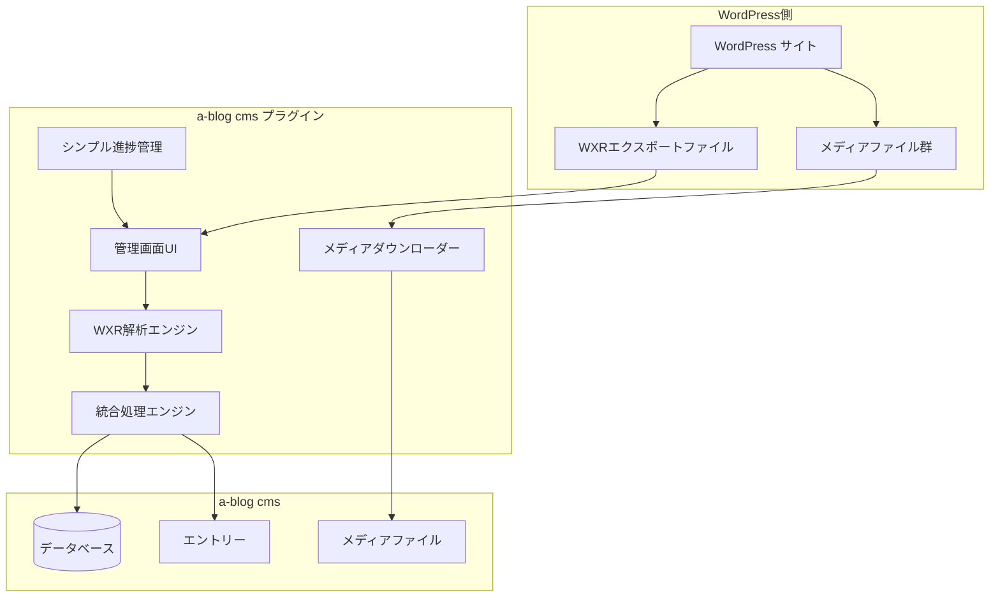
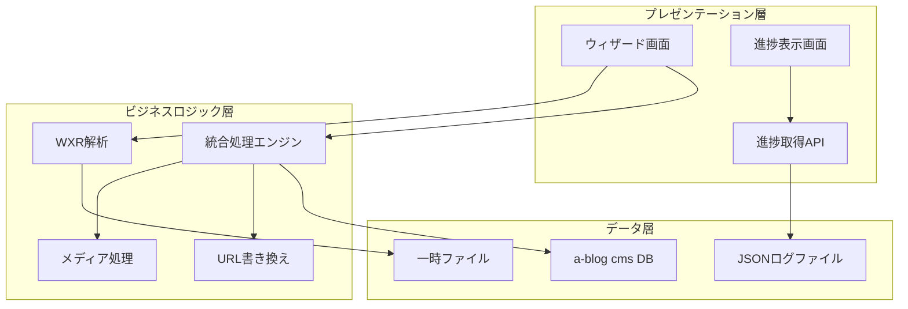

# 機能設計書

## システム概要

### システム構成図



### WXR入力要件

**重要**: このプラグインは、WordPressの「全てのコンテンツ」エクスポートで生成されたWXRファイルを想定しています。

- **対象エクスポート**: WordPress管理画面 → ツール → エクスポート → 「全てのコンテンツ」を選択
- **含まれるデータ**: 投稿、固定ページ、メディア情報、カテゴリー、タグ、コメント等
- **メディア情報**: WXRファイル内にはメディアのメタデータ（URL、サイズ、ALTテキスト等）が含まれるが、実ファイルは別途ダウンロードが必要
- **非対応**: 投稿のみのエクスポートはメディア情報が不完全となるため、移行品質が保証されません

### 簡素化アーキテクチャレイヤー



## データモデル定義

### WXRデータモデル（変更なし）

```php
// WXRエントリーデータ構造
class WXREntry {
    public int $wpPostId;            // WordPress投稿ID
    public string $title;            // タイトル
    public string $content;          // 本文内容
    public string $excerpt;          // 抜粋
    public DateTime $postDate;       // 投稿日時
    public DateTime $modifiedDate;   // 更新日時
    public string $status;           // 公開状態 (publish/draft/private)
    public string $type;             // 投稿タイプ (post/page/attachment)
    public string $slug;             // スラッグ
    public array $categories;        // カテゴリー配列
    public array $tags;              // タグ配列
    public array $customFields;      // カスタムフィールド配列
    public ?int $parentId;           // 親投稿ID (階層構造用)
    public string $author;           // 著者
}

// WXRメディアデータ構造
class WXRMedia {
    public int $wpPostId;            // WordPress添付ファイルID
    public string $title;            // メディアタイトル
    public string $url;              // WordPress側のメディアURL
    public string $fileName;         // ファイル名
    public string $mimeType;         // MIMEタイプ
    public int $fileSize;            // ファイルサイズ
    public DateTime $uploadDate;     // アップロード日時
    public array $metadata;          // メタデータ (width, height等)
    public ?string $altText;         // ALTテキスト
    public ?string $caption;         // キャプション
    public ?string $description;     // 説明文
    public ?int $parentPostId;       // 関連投稿ID
}
```

### 簡素化データ管理

```php
// 移行ログ（JSONファイル形式）
class ImportLog {
    public string $sessionId;        // セッション識別子
    public string $status;           // running/completed/failed
    public int $percentage;          // 進捗パーセンテージ
    public string $currentMessage;   // 現在の処理メッセージ
    public array $processList;      // 処理ログの配列
    public array $statistics;       // 統計情報
    public DateTime $startedAt;     // 開始時刻
    public ?DateTime $completedAt;  // 完了時刻
}

// 統計情報
class ImportStatistics {
    public int $totalItems;          // 総アイテム数
    public int $processedItems;      // 処理済みアイテム数
    public int $successCount;        // 成功数
    public int $errorCount;          // エラー数
    public int $entryCount;          // エントリー数
    public int $mediaCount;          // メディア数
}
```

## 簡素化データ管理

**データベーステーブル不要 - 完全ファイルベース管理**

従来の複雑な3テーブル設計を廃止し、JSONファイルベースの軽量な進捗管理を採用。

**進捗管理はJSONファイル**

```json
// cache/wp-import/progress/{session_id}.json
{
    "session_id": "wp_import_20250111_143020",
    "status": "running",
    "percentage": 75,
    "current_message": "メディアダウンロード中... (543/567)",
    "process_list": [
        {
            "time": "14:30:20",
            "message": "WXR解析完了: 1,234エントリー、567メディア",
            "type": "info"
        },
        {
            "time": "14:32:18",
            "message": "ダウンロード失敗: broken.jpg",
            "type": "warning"
        }
    ],
    "statistics": {
        "total_items": 1801,
        "processed_items": 1350,
        "success_count": 1326,
        "error_count": 24,
        "entry_count": 1234,
        "media_count": 567
    },
    "started_at": "2025-01-11T14:30:20+09:00",
    "completed_at": null
}
```

## コンポーネント設計

### 簡素化サービス層

```
src/Services/
├── WXR/                        # WXR解析関連（実装済み）
│   ├── Parser.php              # XMLパーサーエンジン ✅
│   ├── EntryExtractor.php      # エントリー情報抽出 ✅
│   ├── MediaExtractor.php      # メディア情報抽出 ✅
│   ├── WXREntry.php           # エントリーモデル ✅
│   └── WXRMedia.php           # メディアモデル ✅
│
├── Import/                     # インポート処理関連（実装済み）
│   ├── BatchProcessor.php      # 統合処理エンジン ✅
│   ├── EntryImporter.php       # エントリー移行処理 ✅
│   ├── MediaImporter.php       # メディア移行処理 ✅
│   └── CategoryCreator.php     # カテゴリー自動作成 ✅
│
├── Media/                      # メディア処理関連（実装済み）
│   └── Downloader.php          # ファイルダウンローダー ✅
│
├── Content/                    # コンテンツ処理関連（実装済み）
│   └── UrlRewriter.php         # 本文内URL書き換え ✅
│
└── Common/                     # 共通機能（新規追加）
    ├── ProgressTracker.php      # 進捗管理
    ├── FileLogger.php          # ファイルベースログ
    └── ConfigManager.php       # 設定管理
```

### 新規：簡素化進捗管理

```php
namespace Acms\Plugins\WPImport\Services\Common;

class ProgressTracker {
    private string $sessionId;
    private string $progressFile;

    public function __construct(string $sessionId) {
        $this->sessionId = $sessionId;
        $this->progressFile = CACHE_DIR . "wp-import/progress/{$sessionId}.json";
    }

    public function initialize(int $totalItems): void {
        $this->saveProgress([
            'session_id' => $this->sessionId,
            'status' => 'running',
            'percentage' => 0,
            'current_message' => '処理を開始しています...',
            'process_list' => [],
            'statistics' => [
                'total_items' => $totalItems,
                'processed_items' => 0,
                'success_count' => 0,
                'error_count' => 0
            ],
            'started_at' => date('c')
        ]);
    }

    public function updateProgress(int $percentage, string $message): void {
        $progress = $this->loadProgress();
        $progress['percentage'] = $percentage;
        $progress['current_message'] = $message;
        $progress['process_list'][] = [
            'time' => date('H:i:s'),
            'message' => $message,
            'type' => 'info'
        ];

        // 最新50件のログのみ保持
        $progress['process_list'] = array_slice($progress['process_list'], -50);

        $this->saveProgress($progress);
    }

    public function recordError(string $message, array $context = []): void {
        $progress = $this->loadProgress();
        $progress['statistics']['error_count']++;
        $progress['process_list'][] = [
            'time' => date('H:i:s'),
            'message' => $message,
            'type' => 'error'
        ];

        $this->saveProgress($progress);
        Logger::error($message, $context);
    }

    public function complete(): void {
        $progress = $this->loadProgress();
        $progress['status'] = 'completed';
        $progress['percentage'] = 100;
        $progress['current_message'] = '移行処理が完了しました';
        $progress['completed_at'] = date('c');

        $this->saveProgress($progress);
    }

    private function saveProgress(array $data): void {
        $dir = dirname($this->progressFile);
        if (!is_dir($dir)) {
            mkdir($dir, 0755, true);
        }
        file_put_contents($this->progressFile, json_encode($data, JSON_PRETTY_PRINT | JSON_UNESCAPED_UNICODE));
    }

    private function loadProgress(): array {
        if (!file_exists($this->progressFile)) {
            return [];
        }
        return json_decode(file_get_contents($this->progressFile), true) ?: [];
    }

    public function getProgress(): array {
        return $this->loadProgress();
    }
}
```

### 統合処理エンジン（BatchProcessor簡素化）

既存のBatchProcessorは充実しているため、以下のシンプルな統合処理を追加：

```php
namespace Acms\Plugins\WPImport\Services\Import;

class ImportProcessor {
    private ProgressTracker $progressTracker;
    private Parser $parser;
    private EntryImporter $entryImporter;
    private MediaImporter $mediaImporter;
    private Downloader $downloader;
    private UrlRewriter $urlRewriter;

    public function processWXRFile(string $wxrFilePath, array $settings): array {
        $sessionId = 'wp_import_' . date('Ymd_His');
        $this->progressTracker = new ProgressTracker($sessionId);

        try {
            // Phase 1: WXR解析
            $this->progressTracker->updateProgress(5, 'WXRファイルを解析中...');
            $items = $this->parseWXR($wxrFilePath);

            // Phase 2: メディア処理（先行）
            $mediaMapping = [];
            if ($settings['include_media'] && !empty($items['media'])) {
                $mediaMapping = $this->processMedia($items['media'], $settings);
            }

            // Phase 3: エントリー処理
            $this->processEntries($items['entries'], $settings, $mediaMapping);

            $this->progressTracker->complete();

            return ['success' => true, 'session_id' => $sessionId];

        } catch (Exception $e) {
            $this->progressTracker->recordError('移行処理でエラーが発生しました: ' . $e->getMessage());
            return ['success' => false, 'error' => $e->getMessage(), 'session_id' => $sessionId];
        }
    }

    private function parseWXR(string $filePath): array {
        $entries = [];
        $media = [];

        foreach ($this->parser->parse($filePath) as $item) {
            if ($item['post_type'] === 'attachment') {
                $media[] = $this->mediaExtractor->extract($item);
            } else {
                $entries[] = $this->entryExtractor->extract($item);
            }
        }

        $this->progressTracker->updateProgress(20, "解析完了: {$entries}エントリー、{$media}メディア");

        return ['entries' => $entries, 'media' => $media];
    }

    private function processMedia(array $mediaList, array $settings): array {
        $mapping = [];
        $total = count($mediaList);

        foreach ($mediaList as $index => $media) {
            $progress = 20 + (($index + 1) / $total) * 30; // 20-50%
            $this->progressTracker->updateProgress($progress, "メディア処理中: {$media->fileName}");

            try {
                $downloadResult = $this->downloader->downloadMedia($media);
                if ($downloadResult['success']) {
                    $importResult = $this->mediaImporter->importMedia($media, $settings, $downloadResult['local_path']);
                    if ($importResult['success']) {
                        $mapping[$media->wpPostId] = $importResult['media_id'];
                    }
                }
            } catch (Exception $e) {
                $this->progressTracker->recordError("メディア処理失敗: {$media->fileName} - " . $e->getMessage());
            }
        }

        return $mapping;
    }

    private function processEntries(array $entries, array $settings, array $mediaMapping): void {
        $total = count($entries);

        foreach ($entries as $index => $entry) {
            $progress = 50 + (($index + 1) / $total) * 40; // 50-90%
            $this->progressTracker->updateProgress($progress, "エントリー処理中: {$entry->title}");

            try {
                // URL書き換え
                if (!empty($mediaMapping)) {
                    $rewriteResult = $this->urlRewriter->rewriteUrls($entry->content, ['media_mapping' => $mediaMapping]);
                    $entry->content = $rewriteResult['content'];
                }

                // エントリーインポート
                $this->entryImporter->importEntry($entry, $settings, [], []);

            } catch (Exception $e) {
                $this->progressTracker->recordError("エントリー処理失敗: {$entry->title} - " . $e->getMessage());
            }
        }

        $this->progressTracker->updateProgress(90, '最終処理中...');
    }
}
```

## 簡素化UI設計

### 画面構成の統合（5画面→2画面）

#### 1. 統合ウィザード画面

**機能統合**:
- WXRアップロード
- ファイル情報プレビュー
- カテゴリー設定
- 基本設定
- 移行実行

```
GET/WpImport/Wizard.php          # 統合ウィザード画面
POST/WpImport/Execute.php        # 移行実行処理（既存）
```

#### 2. 進捗・結果表示画面

**機能統合**:
- リアルタイム進捗表示
- 移行完了結果
- エラー詳細表示

```
GET/WpImport/Progress.php        # 進捗API（JSON形式で進捗データを返却）
GET/WpImport/Report.php          # 移行結果レポート画面
```

### ワイヤフレーム：統合ウィザード画面

```
┌─────────────────────────────────────────────────────┐
│ WordPress移行プラグイン                               │
├─────────────────────────────────────────────────────┤
│ [Step 1] ファイル選択 → [Step 2] 設定 → [Step 3] 実行 │
├─────────────────────────────────────────────────────┤
│                                                   │
│ ▼ Step 1: WXRファイル選択                           │
│ ┌─────────────────────────────────────────────┐     │
│ │ [ファイルを選択] または ドラッグ&ドロップ      │     │
│ │ ファイル名: export.xml (25.3MB)             │     │
│ │ エントリー: 1,234件 / メディア: 567件       │     │
│ └─────────────────────────────────────────────┘     │
│                                                   │
│ ▼ Step 2: 移行設定                                  │
│ ┌─────────────────────────────────────────────┐     │
│ │ ☑ メディアファイルを移行する                │     │
│ │ ☑ 本文内URLを自動書き換え                   │     │
│ │ ☐ エラー時は継続して処理                   │     │
│ │                                            │     │
│ │ WordPressカテゴリー → a-blog cmsカテゴリー    │     │
│ │ • 技術 → 技術                              │     │
│ │ • 日記 → ブログ                            │     │
│ │ • 未分類 → (新規作成)                      │     │
│ └─────────────────────────────────────────────┘     │
│                                                   │
│ ▼ Step 3: 実行確認                                 │
│ ┌─────────────────────────────────────────────┐     │
│ │ 移行内容確認:                               │     │
│ │ • エントリー: 1,234件                       │     │
│ │ • メディア: 567件                           │     │
│ │ • 新規カテゴリー: 3件                       │     │
│ │                                            │     │
│ │            [移行開始] ボタン                 │     │
│ └─────────────────────────────────────────────┘     │
└─────────────────────────────────────────────────────┘
```

### ワイヤフレーム：進捗・結果表示画面

```
┌─────────────────────────────────────────────────────┐
│ WordPress移行プラグイン - 処理状況                    │
├─────────────────────────────────────────────────────┤
│                                                   │
│ 移行進捗: ████████████████████░░  82%               │
│ 現在の処理: メディアダウンロード中... (543/567)       │
│                                                   │
│ 詳細ログ: [最新50件]                                │
│ ┌─────────────────────────────────────────────┐     │
│ │ 14:32:15 WXR解析完了: 1,234エントリー、567メディア │   │
│ │ 14:32:16 メディア "image001.jpg" DL成功       │     │
│ │ 14:32:18 ⚠️ メディア "broken.jpg" DL失敗      │     │
│ │ 14:32:19 エントリー "記事タイトル1" 移行完了   │     │
│ │ 14:32:20 URL書き換え実行: 15箇所               │     │
│ └─────────────────────────────────────────────┘     │
│                                                   │
│ 統計情報:                                          │
│ • 成功: 1,326件 / エラー: 24件                      │
│ • エントリー: 1,234件 / メディア: 543件             │
│ • 処理時間: 2時間15分                              │
│                                                   │
│ [移行を中止] [詳細ログをダウンロード]                  │
│                                                   │
│ ※完了時は自動的に結果サマリーを表示                  │
└─────────────────────────────────────────────────────┘
```

## API設計

### 簡素化REST API

```php
// 進捗取得API（簡素化）
GET /admin/wp-import/ajax/progress?session_id={session_id}
Response: {
    "session_id": "wp_import_20250111_143020",
    "status": "running|completed|failed",
    "percentage": 75,
    "current_message": "メディアダウンロード中... (543/567)",
    "statistics": {
        "total_items": 1801,
        "processed_items": 1350,
        "success_count": 1326,
        "error_count": 24
    },
    "process_list": [
        {"time": "14:32:15", "message": "処理開始", "type": "info"},
        {"time": "14:32:18", "message": "エラー発生", "type": "error"}
    ]
}

// 移行実行API（簡素化）
POST /admin/wp-import/execute
Request: {
    "wxr_file_path": "/tmp/export.xml",
    "settings": {
        "include_media": true,
        "url_rewrite": true,
        "skip_errors": false
    }
}
Response: {
    "success": true,
    "session_id": "wp_import_20250111_143020",
    "message": "移行処理を開始しました"
}
```

## エラーハンドリング

### 簡素化エラー処理

```php
namespace Acms\Plugins\WPImport\Services\Common;

class ErrorHandler {
    private ProgressTracker $progressTracker;

    public function handleError(Exception $exception, string $context = ''): void {
        $errorMessage = $context ? "{$context}: {$exception->getMessage()}" : $exception->getMessage();

        // 重大度に応じた処理
        if ($this->isCriticalError($exception)) {
            $this->progressTracker->recordError($errorMessage);
            Logger::error($errorMessage, ['trace' => $exception->getTraceAsString()]);
            throw $exception; // 処理停止
        } else {
            $this->progressTracker->recordError($errorMessage);
            Logger::warning($errorMessage);
            // 処理継続
        }
    }

    private function isCriticalError(Exception $exception): bool {
        return $exception instanceof SecurityException ||
               $exception instanceof WXRParseException ||
               strpos($exception->getMessage(), 'Fatal') !== false;
    }
}
```

## 実装優先度

### Phase 1: 既存機能の活用（完了済み）
- ✅ WXR解析エンジン
- ✅ エントリー・メディア移行機能
- ✅ バッチ処理機能
- ✅ URL書き換え機能

### Phase 2: UI簡素化（推奨）
- 🔄 5画面→2画面への統合
- 🔄 ウィザード形式の導入
- 🔄 進捗表示の簡素化

### Phase 3: 進捗管理簡素化（推奨）
- ⭕ ProgressTracker実装
- ⭕ JSONファイルベース進捗管理
- ⭕ データベーステーブル削減

### Phase 4: 統合処理エンジン（オプション）
- 💡 ImportProcessor実装
- 💡 設定管理の簡素化
- 💡 エラーハンドリング統一

この簡素化により、MVPとして必要十分な機能を効率的に提供し、保守性の向上を実現できます。
