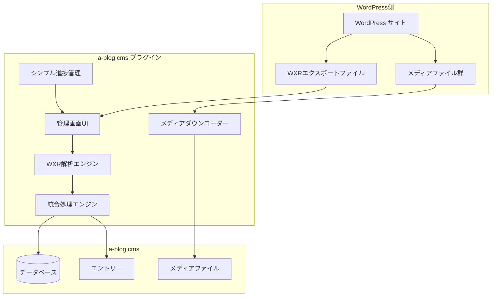
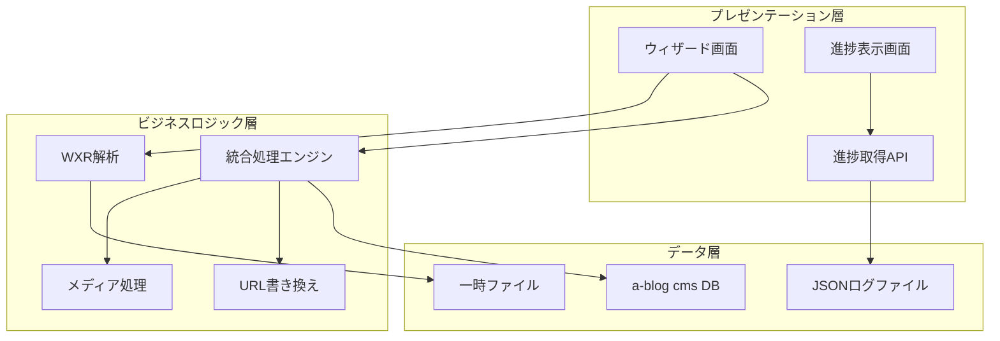

# 機能設計書

## システム概要

### システム構成図



### WXR入力要件

**重要**: このプラグインは、WordPressの「全てのコンテンツ」エクスポートで生成されたWXRファイルを想定しています。

- **対象エクスポート**: WordPress管理画面 → ツール → エクスポート → 「全てのコンテンツ」を選択
- **含まれるデータ**: 投稿、固定ページ、メディア情報、カテゴリー、タグ、コメント等
- **メディア情報**: WXRファイル内にはメディアのメタデータ（URL、サイズ、ALTテキスト等）が含まれるが、実ファイルは別途ダウンロードが必要
- **非対応**: 投稿のみのエクスポートはメディア情報が不完全となるため、移行品質が保証されません

### 簡素化アーキテクチャレイヤー



## データモデル定義

### WXRデータモデル（）

```php
// WXRエントリーデータ構造
class WXREntry {
    public int $wpPostId;            // WordPress投稿ID
    public string $title;            // タイトル
    public string $content;          // 本文内容
    public string $excerpt;          // 抜粋
    public DateTime $postDate;       // 投稿日時
    public DateTime $modifiedDate;   // 更新日時
    public string $status;           // 公開状態 (publish/draft/private)
    public string $type;             // 投稿タイプ (post/page/attachment)
    public string $slug;             // スラッグ
    public array $categories;        // カテゴリー配列（WXRCategoryオブジェクト）
    public array $tags;              // タグ配列（WXRTagオブジェクト）
    public array $customFields;      // カスタムフィールド配列
    public ?int $parentId;           // 親投稿ID (階層構造用)
    public string $author;           // 著者
}

// WXRメディアデータ構造
class WXRMedia {
    public int $wpPostId;            // WordPress添付ファイルID
    public string $title;            // メディアタイトル
    public string $url;              // WordPress側のメディアURL
    public string $fileName;         // ファイル名
    public string $mimeType;         // MIMEタイプ
    public int $fileSize;            // ファイルサイズ
    public DateTime $uploadDate;     // アップロード日時
    public array $metadata;          // メタデータ (width, height等)
    public ?string $altText;         // ALTテキスト
    public ?string $caption;         // キャプション
    public ?string $description;     // 説明文
    public ?int $parentPostId;       // 関連投稿ID
}

// WXRカテゴリーデータ構造
class WXRCategory {
    public string $slug;             // カテゴリースラッグ
    public string $name;             // カテゴリー名
    public string $description;      // 説明文
    public ?string $parent;          // 親カテゴリースラッグ
}

// WXRタグデータ構造
class WXRTag {
    public string $slug;             // タグスラッグ
    public string $name;             // タグ名
    public string $description;      // 説明文
}
```

## 進捗管理システム

**`\Acms\Services\Common\Logger`ベースの進捗管理**

既存のa-blog cms Loggerサービスを活用したシンプルな進捗管理を採用。

**主要特徴:**
- シンプルなJSON構造でメンテナンス性が高い
- 既存のa-blog cmsログシステムとの統合
- リアルタイムな進捗追跡とメッセージ更新

## コンポーネント設計

### サービス層

```
src/Services/
├── WXR/                        # WXR解析関連（）
│   ├── Parser.php              # XMLパーサーエンジン ✅
│   ├── EntryExtractor.php      # エントリー情報抽出 ✅
│   ├── MediaExtractor.php      # メディア情報抽出 ✅
│   ├── WXREntry.php           # エントリーモデル ✅
│   ├── WXRMedia.php           # メディアモデル ✅
│   ├── WXRCategory.php        # カテゴリーモデル ✅
│   └── WXRTag.php             # タグモデル ✅
│
├── Import/                     # インポート処理関連（）
│   ├── BatchProcessor.php      # 統合処理エンジン ✅
│   ├── EntryImporter.php       # エントリー移行処理 ✅
│   ├── MediaImporter.php       # メディア移行処理 ✅
│   └── CategoryCreator.php     # カテゴリー自動作成 ✅
│
├── Media/                      # メディア処理関連（）
│   └── Downloader.php          # ファイルダウンローダー ✅
│
├── Content/                    # コンテンツ処理関連（）
│   └── UrlRewriter.php         # 本文内URL書き換え ✅
│
├── Unit/                       # ユニット処理関連（）
│   └── ContentUnitCreator.php  # コンテンツユニット生成 ✅
│
└── Helpers/                    # ヘルパー機能（）
    └── CodeGenerator.php       # コード生成ヘルパー ✅

注: 進捗管理は既存のa-blog cms \Acms\Services\Common\Loggerを活用
```

### 進捗管理（`\Acms\Services\Common\Logger`利用）

**BatchProcessor.php での進捗管理実装**

```php
// BatchProcessor クラス内で Logger を活用した進捗管理
public function processAll(
    array $entries,
    array $medias,
    array $categories,
    array $settings,
    \Acms\Services\Common\Logger $progressLogger // ← Logger注入
): array {
    // カテゴリー処理
    if ($settings['create_categories'] && count($categories) > 0) {
        $progressLogger->addMessage('カテゴリーを作成中...', 5, 1, false);
        $categoryMap = $this->processCategoryCreation($categories, $settings);
        $progressLogger->addMessage('カテゴリー作成完了: ' . count($categoryMap) . '件', 5, 1, true);
    }

    // エントリー処理の進捗報告
    $progressLogger->addMessage("エントリー処理開始: {$totalEntries}件", 0, 1, false);

    // バッチ処理の進捗更新
    $progressLogger->addMessage(
        "処理済み: {$processedCount}/{$totalEntries} (成功: {$successCount}, エラー: {$errorCount}) - 処理時間: " . number_format($batchTime, 2) . "秒",
        (50 / ceil($totalEntries / $batchSize)), 1, true
    );
}
```

**進捗取得API実装（ProgressJson.php）**

```php
class ProgressJson extends ACMS_POST
{
    public function post()
    {
        $logger = Application::make('common.logger');
        assert($logger instanceof \Acms\Services\Common\Logger);
        $logger->setDestinationPath(CACHE_DIR . 'wp-import-progress.json');

        $output = [
            'message' => 'No log found',
            'status' => 'notfound',
        ];

        $json = json_encode($logger->getJson());
        if ($json !== false) {
            $output = json_decode($json, true);
        }
        Common::responseJson($output);
    }
}
```

### 統合処理エンジン（BatchProcessor）

既存のBatchProcessorが統合処理を完全に担当：

**BatchProcessor.php の実装抜粋**

```php
/**
 * 全データの統合処理（カテゴリー、メディア、エントリー）
 */
public function processAll(
    array $entries,
    array $medias,
    array $categories,
    array $settings,
    \Acms\Services\Common\Logger $progressLogger
): array {
    try {
        // 1. カテゴリー作成（最初に実行）
        $categoryMap = [];
        if ($settings['create_categories'] && count($categories) > 0) {
            $progressLogger->addMessage('カテゴリーを作成中...', 5, 1, false);
            $categoryMap = $this->processCategoryCreation($categories, $settings);
            $progressLogger->addMessage('カテゴリー作成完了: ' . count($categoryMap) . '件', 5, 1, true);
        }

        // 2. メディア・エントリー統合処理
        $processResults = $this->processComplete($entries, $medias, $settings, $categoryMap, $progressLogger);

        return array_merge($processResults, ['category_success' => count($categoryMap)]);
    } catch (\Throwable $th) {
        Logger::error('【WPImport plugin】統合処理エラー', [
            'error' => $th->getMessage(),
            'trace' => $th->getTraceAsString()
        ]);
        throw $th;
    }
}

/**
 * エントリーと関連メディアを統合処理
 */
public function processComplete(
    array $entries,
    array $medias,
    array $settings,
    array $categoryMap,
    \Acms\Services\Common\Logger $progressLogger
): array {
    // メディアファイルを優先処理（エントリー処理でURL書き換えに必要）
    if ($settings['include_media'] && count($medias) > 0) {
        $mediaResults = $this->processMediaBatch($medias, $settings, $progressLogger);
        $mediaMapping = $this->buildMediaMapping($mediaResults['results']);
    } else {
        $mediaMapping = [];
    }

    // エントリーを処理
    $entryResults = $this->processEntryBatch(
        $entries,
        $settings,
        $categoryMap,
        $mediaMapping,
        $progressLogger
    );

    return [
        'entry_success' => $entryResults['success_count'],
        'entry_error' => $entryResults['error_count'],
        'media_success' => $mediaResults['success_count'] ?? 0,
        'media_error' => $mediaResults['error_count'] ?? 0,
    ];
}
```

## UI設計

### シンプル1画面設計

**実装されたUI構成**:
- 1つの統合画面でファイルアップロード・設定・実行・進捗表示をすべて処理
- アップロード後は同じ画面にリダイレクトして進捗バーを表示

#### 画面フロー

```
1. 初回アクセス
   ↓
2. WXRファイルアップロード + 設定 → POST実行
   ↓
3. 同じ画面にリダイレクト + 進捗表示モード
   ↓
4. リアルタイム進捗更新（Ajax）
   ↓
5. 完了結果表示
```

#### 実装ファイル構成

```
GET/Admin/WpImport/Progress.php  # メイン統合画面
POST/WpImport/Execute.php        # アップロード・移行実行処理
POST/WpImport/ProgressJson.php   # 進捗データJSON取得API
```

### ワイヤフレーム：統合画面（初期状態）

```
┌─────────────────────────────────────────────────────┐
│ WordPress移行プラグイン                               │
├─────────────────────────────────────────────────────┤
│                                                   │
│ WXRファイルアップロード                              │
│ ┌─────────────────────────────────────────────┐     │
│ │ [ファイルを選択] または ドラッグ&ドロップ      │     │
│ │                                            │     │
│ │ ※WordPressの「全てのコンテンツ」エクスポート   │     │
│ │   で生成されたWXRファイルをアップロード      │     │
│ └─────────────────────────────────────────────┘     │
│                                                   │
│ 移行設定                                           │
│ ┌─────────────────────────────────────────────┐     │
│ │ ☑ メディアファイルを移行する                │     │
│ │ ☑ 本文内URLを自動書き換え                   │     │
│ │ ☑ カテゴリーを自動作成                     │     │
│ │ バッチサイズ: [20] 件                      │     │
│ └─────────────────────────────────────────────┘     │
│                                                   │
│                [移行開始] ボタン                     │
│                                                   │
└─────────────────────────────────────────────────────┘
```

### ワイヤフレーム：統合画面（進捗表示状態）

```
┌─────────────────────────────────────────────────────┐
│ WordPress移行プラグイン - 処理中                      │
├─────────────────────────────────────────────────────┤
│                                                   │
│ 移行進捗: ████████████████████░░  82%               │
│ 現在の処理: メディアダウンロード中... (543/567)       │
│                                                   │
│ 処理状況 (リアルタイム更新):                         │
│ ┌─────────────────────────────────────────────┐     │
│ │ ✅ WXR解析完了: 1,234エントリー、567メディア   │     │
│ │ ✅ カテゴリー作成完了: 5件                   │     │
│ │ 🔄 メディア処理中: 543/567 完了               │     │
│ │ ⚠️ メディア "broken.jpg" DL失敗              │     │
│ │ 🔄 エントリー処理中: 1,200/1,234 完了         │     │
│ └─────────────────────────────────────────────┘     │
│                                                   │
│ ※処理完了時は自動的に結果サマリーを表示              │
│                                                   │
└─────────────────────────────────────────────────────┘
```

### ワイヤフレーム：統合画面（完了状態）

```
┌─────────────────────────────────────────────────────┐
│ WordPress移行プラグイン - 完了                        │
├─────────────────────────────────────────────────────┤
│                                                   │
│ ✅ 移行処理が完了しました                           │
│                                                   │
│ 移行結果サマリー:                                  │
│ ┌─────────────────────────────────────────────┐     │
│ │ エントリー: 1,234件移行完了                   │     │
│ │ メディア: 543件移行完了 (24件失敗)            │     │
│ │ カテゴリー: 5件作成                          │     │
│ │ 処理時間: 1時間23分                          │     │
│ └─────────────────────────────────────────────┘     │
│                                                   │
│                [新しい移行を開始] ボタン               │
│                                                   │
└─────────────────────────────────────────────────────┘
```

## エラーハンドリング

### BatchProcessor内のエラー処理

**統合的なエラーハンドリング実装**

```php
// BatchProcessor.php でのエラー処理例
public function processAll(...): array {
    try {
        // 処理実行
        return $this->processComplete($entries, $medias, $settings, $categoryMap, $progressLogger);
    } catch (\Throwable $th) {
        Logger::error('【WPImport plugin】統合処理エラー', [
            'error' => $th->getMessage(),
            'trace' => $th->getTraceAsString()
        ]);
        throw $th; // 重要なエラーは再スロー
    }
}

// 個別処理でのエラー処理
foreach ($batch as $entry) {
    try {
        $result = $this->entryImporter->importEntry($entry, $settings, $categoryMap);
        if ($result['success']) {
            $successCount++;
        } else {
            $errorCount++;
            // 処理継続（非致命的エラー）
            Logger::warning('【WPImport plugin】エントリー処理失敗', [
                'wp_post_id' => $entry->wpPostId,
                'title' => $entry->title,
                'error' => $result['error'] ?? 'Unknown error'
            ]);
        }
    } catch (\Throwable $th) {
        $errorCount++;
        // 例外をキャッチして処理継続
        Logger::error('【WPImport plugin】エントリー処理エラー', [
            'wp_post_id' => $entry->wpPostId,
            'title' => $entry->title,
            'error' => $th->getMessage(),
            'trace' => $th->getTraceAsString()
        ]);
    }
}
```

### ログレベル分類

- **Logger::error()** - 致命的エラー（処理停止）
- **Logger::warning()** - 重要な警告（処理継続）
- **Logger::debug()** - デバッグ情報（開発時のみ）
